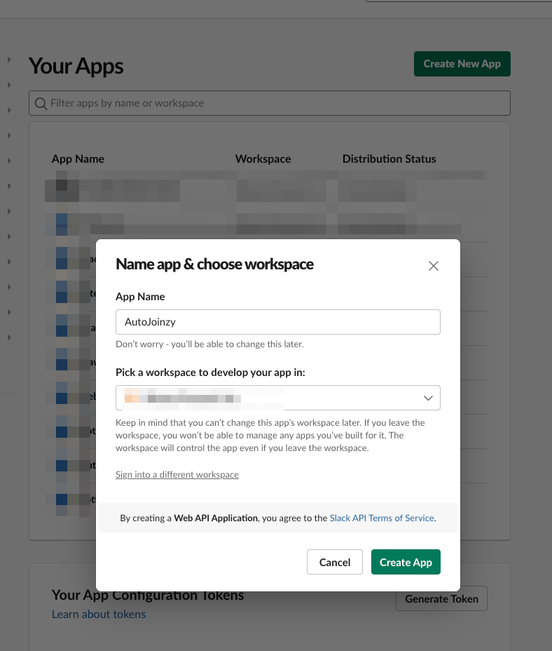
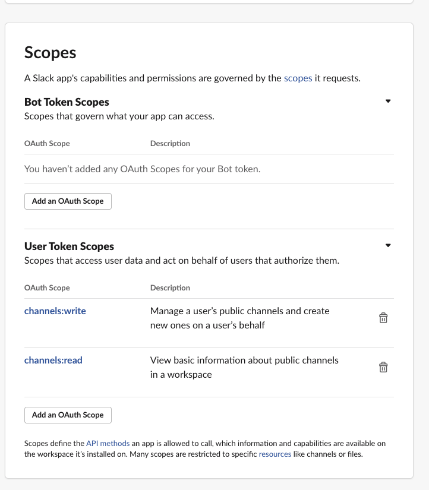
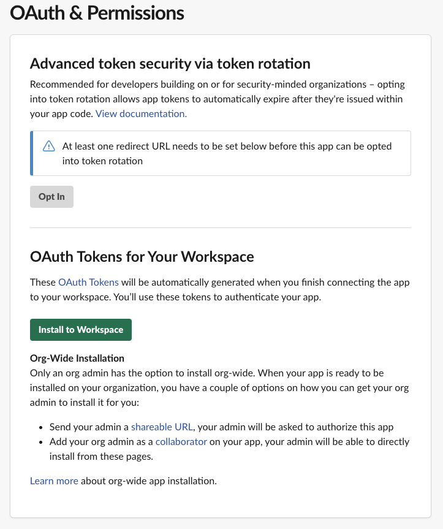

# AutoJoinzy

Join the Slack channels listed in Yaml.

# How to use

Download code.

```sh
git clone https://github.com/VTRyo/AutoJoinzy
```

```sh
cd AutoJoinzy
```

## Slack Token

Issue User token in [Slack App](https://api.slack.com/apps/).
Permissions are `channels:write` and `channels:read`

1. Create an App with `Create New App`


2. Authorization with `User Token Scopes` on `OAuth & Permissions` page.
   3. `channels:write` and `channels:read`


4. Press "Install To Workspace" to install the App into the workspace



5. Copy the `User OAuth Token` and register it as `SLACK_TOKEN` in the program execution environment variable


## config.yaml

Describe the name of the channel you wish to join. 

NOTE: Must be a public channel.

```yaml
# sample
channels:
  - times_ryo
  - programming
  - yatteiki
```

### Execute

Run the Go program.

```sh
go run main.go
```